# Phasefinity – Architecture Overview

*Last updated: 2025‑06‑18*

## 1. Tech Stack

| Layer     | Library / Tool                              | Notes                                    |
| --------- | ------------------------------------------- | ---------------------------------------- |
| Build     | **Vite** + React 18                         | Fast dev server & HMR                    |
| Framework | **React** with **TypeScript**               | Strict typing across reducers & services |
| State     | **React Context + useReducer** (single store) | 4 slices: `game`, `score`, `level`, `handLevels` |
| Styling   | CSS modules                                 | Lightweight, no runtime dependency       |
| Audio     | `Howler.js` via helper (`playDealSound.ts`) | SFX only                                 |
| Data      | Single static JSON in `/config/gameConfig.json` | All scoring, leveling, and hand data     |

## 2. High‑Level Flow

```
TO DO  
```

1.  **Start →** `AppProvider` initializes the store; `INITIALIZE_GAME` creates a shuffled deck.
2.  **Deal →** `GameControls` dispatches actions to move cards from `deck` ➜ `hand`.
3.  **Play →** Player drags cards; positions live in `Card.position`.
4.  **Evaluate →** On "Play Hand" in `GameControls`, the pipeline runs:
    `handEvaluator.ts` » `scoreManager.ts`.
5.  The single `rootReducer` updates the appropriate state slice, UI re‑renders.

## 3. Key Modules

### 3.1 State Slices (`/store/*`)

| File                  | Responsibility                                                 |
| --------------------- | -------------------------------------------------------------- |
| `gameSlice.ts`        | Canonical deck/board state, turn flags                         |
| `scoreSlice.ts`       | Total chips, current multiplier, history of scores             |
| `levelSlice.ts`       | Player level, turns/discards remaining                         |
| `handLevelsSlice.ts`  | XP & level per hand type (`HandType`)                          |

All slices are combined in `store.tsx`'s `rootReducer`.

### 3.2 Services (`/services`)

| Service             | Purpose                                                              |
| ------------------- | -------------------------------------------------------------------- |
| `handEvaluator.ts`  | Pure function: determines hand type (straight, flush, etc.).         |
| `scoreManager.ts`   | Pure function: calculates final score from hand type, cards, & state.|
| `handLevelManager.ts`| Pure functions: computes derived multipliers from hand level state. |
| `levelService.ts`   | Pure functions: provides access to player level configuration.      |
| `bonuses/*`         | Pluggable bonus rules (e.g. `cardFaceChipBonus.ts`)                  |

### 3.3 Hooks

* **`useAppContext`** – (in `store.tsx`) Provides global `state` and `dispatch`.
* **`useAnimation.ts`** – RAF‑based animation loop that lowers re‑renders.
* **`useMousePosition.ts` / `useWindowSize.ts`** – Generic helpers.

### 3.4 Config

```
/config/gameConfig.json   // Single source of truth for all game values
```

## 4. Data Models

```ts
type HandType = "pair" | "twoPair" | "threeOfAKind" | ...;
interface Card {
  id: number; label: string; value: number; suit: "♠︎"|"♥︎"|...;
  position: "deck"|"hand"|"board"|"discard";
  selected: boolean;
}
interface ScoreCalculation {
  chips: number;
  multiplier: number;
  bonuses: string[];
}
```

> 💡 **Note:** The same `HandType` enum is referenced in configs *and* code; single‑source‑of‑truth is `/types/scoreTypes.ts`.

## 5. Rendering Layer

* Canvas‑less DOM approach; each card is an absolutely‑positioned `<div>` styled via CSS ‑ avoids WebGL dependency.
* Drag logic relies on mouse events captured in `CardComponent.tsx`.
* Animations handled by CSS transitions + `useAnimation` hook for smoothness.

## 6. Build / Tooling

* `npm run dev` → vite server
* `npm run build` → static bundle under `/dist`.
* `tsconfig.app.json` + `tsconfig.node.json` keep server scripts isolated.

---

## 7. Identified Pain Points & **Specific Refactors**

| #  | Issue                                                                      | Recommendation / Status                                                                                                                     |
| -- | -------------------------------------------------------------------------- | ---------------------------------------------------------------------------------------------------------------------------------- |
| 1  | **Reducers sprawl** – three separate reducers glued together in `App.tsx`. | **DONE.** Switched to a single `rootReducer` with a global `AppContext` provider. All state is managed in one place. |
| 2  | **Mutable `Map` inside `HandLevelService`** leaks via methods.             | **DONE.** Replaced with a `handLevels` state slice and pure functions in `handLevelManager.ts` for calculations. |
| 3  | **Config duplication** (`scoreConfig.json` vs in‑code defaults).           | **DONE.** Merged all numeric tables into a single `gameConfig.json`. All services and reducers now read from this file. |

---

## 8. Current Scoring Pipeline - Technical Documentation

### 8.1 Narrative Walkthrough

| Step | File / Function | What Happens | Data Touched |
|------|----------------|--------------|--------------|
| ① | Player clicks Play Hand button | `GameControls.tsx` → score calculation pipeline | `gameState.cards` (board position), selected hand |
| ② | Hand evaluation | `evaluateHand(cards)` in `handEvaluator.ts` | Returns `{ handType, highCard }` |
| ③ | Score calculation | `calculateScore()` in `scoreCalculator.ts` | Looks up base values from `gameConfig.json.hands[handType]` |
| ④ | Bonuses applied | `calculateCardValueBonuses()` & `calculateOtherBonuses()` | Accumulates chip bonuses and multiplier bonuses from card values and special conditions |
| ⑤ | Final maths | Still in `calculateScore()` | `finalScore = currentChips × currentMultiplier` |
| ⑥ | Progress check | Score dispatch → level progression logic | Updates `totalScore`, checks against `requiredScore` for level completion |

**Key Implementation Note:** Chip bonuses and multiplier bonuses are **additive**, not multiplicative. This is crucial for game balance.

### 8.2 Mermaid Flow Diagram

```mermaid
flowchart TD
    A[Player clicks Play Hand] --> B[evaluateHand - handEvaluator.ts]
    B --> C{Hand Type Detection}
    C --> D[Lookup baseChips & multiplier<br/>from gameConfig.json]
    D --> E[calculateCardValueBonuses]
    E --> F[calculateOtherBonuses]
    F --> G[chipBonus accumulation<br/>+= cardValues, +special bonuses]
    F --> H[multiplierBonus accumulation<br/>*= ace/face bonuses]
    G --> I[currentChips = baseChips + chipBonus]
    H --> J[currentMultiplier = baseMultiplier * multiplierBonus]
    I --> K[finalScore = currentChips × currentMultiplier]
    J --> K
    K --> L[Update totalScore += finalScore]
    L --> M[Check level progression]
```



---

## 9. Upgrade Economy System - Specification Draft

### 9.1 Shared Domain Types (TypeScript)

The following interfaces define the core data structures for the upgrade economy:

```typescript
/** Point-in-time score data for different hand types */
export interface HandScoreConfig {
  name: string;          // "Pair", "Straight", etc.
  baseChips: number;     // chips awarded before bonuses
  multiplier: number;    // base multiplier
}

/** Configuration for purchasable joker cards */
export interface JokerConfig {
  id: string;            // "mult_+1", "chips_+10", etc.
  label: string;         // UI display name
  description: string;   // tooltip/description text
  chipBonus: number;     // additive chip bonus
  multiplierBonus: number; // additive multiplier bonus  
  price: number;         // cost in coins
  rarity: 'common'|'rare'|'legendary';
}

/** Configuration for hand-specific upgrades */
export interface HandUpgradeConfig {
  handType: keyof typeof handScores; // 'pair'|'twoPair'|etc.
  chipDelta: number;                 // +N chips per upgrade tier
  multDelta: number;                 // +N multiplier per upgrade tier
  levelCap: number;                  // maximum upgrade tiers
  basePrice: number;                 // price for tier 1
}

/** Items available for purchase in the shop */
export interface ShopItem {
  type: 'joker'|'handUpgrade';
  data: JokerConfig | {upgrade: HandUpgradeConfig; tier: number};
  price: number;  // cached for price stability
}

/** Player's economic state and inventory */
export interface PlayerEconomyState {
  coins: number;
  ownedJokers: JokerConfig[];
  handUpgrades: Record<string /*handType*/, number /*current tier*/>;
}
```

### 9.2 Coins System

| Rule | Value |
|------|-------|
| Level completion reward | +5 coins (flat) |
| Unused hands bonus | +1 coin × handsRemaining |
| Storage | `playerState.coins` in memory → localStorage |

**Implementation Strategy:**
- Add `grantCoins(amount)` helper for centralized UI toasts and SFX
- Hook into existing level completion logic where `turnsTaken` is reset

### 9.3 Shop System

| Requirement | Implementation Detail |
|-------------|----------------------|
| **Trigger** | Immediately after level completion, before `setupNewLevel()` |
| **Inventory** | 3-5 random `ShopItems`: 70% jokers, 30% hand upgrades |
| **UI** | Overlay panel with item cards showing icon, name, description, price |
| **Transaction** | `onBuy(item)` → deduct coins → update `playerState` → remove from shop |
| **Persistence** | Save `playerState` to localStorage after each purchase |

### 9.4 Implementation Phases

**Phase 1** ✅ - Architecture documentation  
**Phase 2** ✅ - Shared domain types  
**Phase 3** 🚧 - Coins system  
**Phase 4** 📋 - Shop system  
**Phase 5** 📋 - Jokers 2.0 (JSON configuration)  
**Phase 6** 📋 - Hand-specific upgrades  
**Phase 7** 📋 - Items slot (consumables placeholder)  

### 9.5 Future Enhancements

- **Joker rarity balancing**: `price = floor((chipBonus * 0.8) + (multiplierBonus * 5)) * rarityMultiplier`
- **Hand upgrade pricing**: Geometric scaling `price = basePrice × 1.75^tier`
- **Consumable items**: One-shot effects that manipulate draw pile or allow discards/redraws
